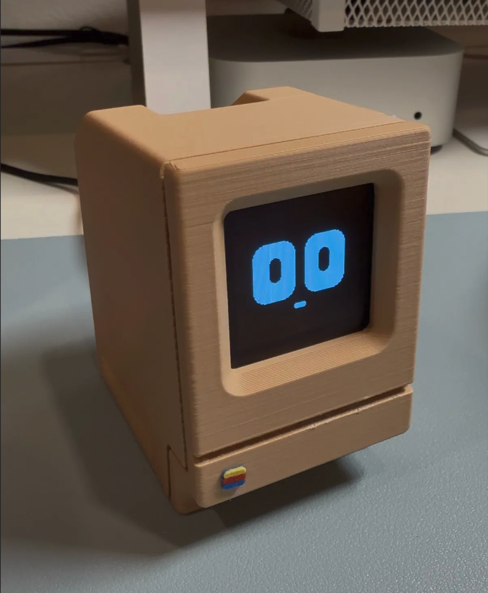

# Hero ESP32 Voice Assistant

<p align="center">
  
</p>

Hero is a source-controlled voice-assistant firmware for the **Seeed Studio XIAO ESP32-S3
Sense**, a **128x128 SH1107 OLED**, and a **MAX98357A I2S speaker amplifier**. It is based on the
official open-source [Xiaozhi ESP32](https://github.com/78/xiaozhi-esp32) project, pinned to
upstream version 2.4.1 and extended with a dedicated Hero board definition.

This repository contains the complete buildable source and a ready-to-flash package. It does not
use the opaque MakerWorld firmware.

## What Hero includes

- Offline **“Hey Hero”** wake-word recognition on the ESP32-S3 using Espressif ESP-SR MultiNet5.
- A 128x128 monochrome face with eyes and a small animated mouth—no status text over the face.
- Calm randomized idle gestures: looking around, blinking, winking, curious movement, and sleepy
  movement.
- A distinct focused-eye gesture and pulsing mouth while listening.
- Faster asymmetric eye and mouth motion while speaking.
- XIAO Sense-board PDM microphone input.
- MAX98357A digital I2S speaker output with a recommended initial volume of 75%.
- Wi-Fi provisioning, Xiaozhi account activation, cloud conversation, and BOOT-button fallback.
- An 8 MB dual-OTA partition layout enlarged to hold the English wake-word assets.
- Diagnostic firmware and reproducible normal-release firmware.

## How it works

The large language model does **not** run on the ESP32. Hero uses a split architecture:

1. The ESP32 continuously runs the small offline “Hey Hero” detector.
2. After the wake word, the ESP32 opens an encrypted network session and streams microphone audio.
3. The configured Xiaozhi service performs speech recognition, language-model inference, and
   text-to-speech.
4. Compressed response audio returns to the ESP32 and plays through the MAX98357A.
5. Listening, thinking, speaking, idle, offline, and error animations run locally on the ESP32.

The wake word and BOOT button work locally. Conversational answers require working Wi-Fi and a
configured service account.

## Required hardware

| Item | Notes |
|---|---|
| Seeed Studio XIAO ESP32-S3 Sense | 8 MB flash and 8 MB PSRAM; use the Sense expansion board for its PDM microphone |
| SH1107 OLED | 128x128, four-wire I2C, normally address `0x3C` or `0x3D` |
| MAX98357A amplifier | I2S mono class-D breakout |
| Speaker | Connect only to the amplifier's `SPK+` and `SPK-` terminals |
| Jumper wires | Female-to-female wires for modules with fitted headers, or soldered wires |
| USB data cable | Must carry data, not power only |
| Optional mini breadboard | Not required; useful only for mechanically holding modules or distributing power/ground |

## Exact wiring

Disconnect USB power while making connections. All module grounds must be common.

### OLED to XIAO

| OLED pin | XIAO pin label | ESP32-S3 GPIO | Supply |
|---|---|---:|---|
| `SDA` | `D4` | GPIO5 | — |
| `SCL`/`SCK` | `D5` | GPIO6 | — |
| `VCC` | `3V3` | — | **3.3 V only** |
| `GND` | `GND` | — | Ground |

### MAX98357A to XIAO

| MAX98357A pin | XIAO pin label | ESP32-S3 GPIO | Function |
|---|---|---:|---|
| `BCLK`/`BCK` | `D1` | GPIO2 | I2S bit clock |
| `DIN` | `D3` | GPIO4 | I2S audio data |
| `LRC`/`LRCLK`/`WS` | `D8` | GPIO7 | I2S word select |
| `VIN` | `5V`/`VBUS` | — | 5 V from USB |
| `GND` | `GND` | — | Ground |

Leave `GAIN`, `SD`, and `MODE` at the breakout's defaults unless its manufacturer requires `SD`
to be pulled high for enable.

### Speaker to amplifier

| Speaker lead | Connect to |
|---|---|
| Lead 1 | MAX98357A `SPK+` |
| Lead 2 | MAX98357A `SPK-` |

Never connect either speaker lead to ground. The amplifier uses a bridge-tied output.

### Microphone

The microphone is already on the XIAO ESP32-S3 Sense expansion board:

| Microphone signal | ESP32-S3 GPIO | External wire required? |
|---|---:|---|
| PDM DATA | GPIO41 | No |
| PDM CLK | GPIO42 | No |

The Sense expansion board must be installed and oriented correctly. No separate microphone jumper
wires are needed.

### Is a breadboard required?

No. Connect the OLED and amplifier directly with jumper wires or soldered connections. A mini
breadboard is optional when you want strain relief, a tidier prototype, or an easy way to split
`GND`, `3V3`, or `5V`. Do not join `3V3` and `5V` rails.

## Choose an installation path

| Path | Intended user | What they need |
|---|---|---|
| **A. Flash the ready-to-use binary** | Someone assembling an identical Hero who does not want to edit code | One prebuilt `.bin`, Python, and esptool; ESP-IDF is not required |
| **B. Build from source** | A developer changing pins, animations, audio, wake behavior, or other firmware | This repository's source and ESP-IDF 6.0.2 |

Both paths install the same normal conversational Hero firmware. The diagnostic image under
`release/diagnostic/` is only for hardware testing.

## Path A: flash the ready-to-use binary

Download
[`hero-xiao-esp32s3-sense-full.bin`](https://github.com/vikramsinghvirdi/Hero-ESP32/raw/refs/heads/main/release/hero-xiao-esp32s3-sense-full.bin).
It is a complete 8 MB flash image containing the bootloader, partition table, OTA metadata, Hero
application, and offline wake-word assets at their correct addresses. Flash this file at address
`0x0`. Do not flash the smaller application-only `hero-xiao-esp32s3-sense.bin` at `0x0`.

This binary is for the exact XIAO ESP32-S3 Sense, SH1107 OLED, and MAX98357A wiring documented
above. A full erase is recommended for a new device because it removes settings left by unrelated
firmware. It also deletes previously saved Wi-Fi and activation data.

### macOS or Linux

1. Install Python 3 and esptool:

   ```sh
   python3 -m pip install --user esptool
   ```

2. Connect Hero with a known data-capable cable and find the serial port:

   ```sh
   # macOS
   ls /dev/cu.usbmodem* /dev/cu.usbserial* 2>/dev/null

   # Linux
   ls /dev/ttyACM* /dev/ttyUSB* 2>/dev/null
   ```

3. If you cloned or downloaded the repository, verify the binary:

   ```sh
   cd release
   shasum -a 256 -c SHA256SUMS.txt
   ```

4. Erase the board and write the single full image at `0x0`:

   ```sh
   python3 -m esptool --chip esp32s3 -p /dev/cu.usbmodem101 erase-flash
   python3 -m esptool --chip esp32s3 -p /dev/cu.usbmodem101 -b 460800 \
     --before default-reset --after hard-reset write-flash 0x0 \
     hero-xiao-esp32s3-sense-full.bin
   ```

   Replace the example port with the detected port. On Linux it will normally resemble
   `/dev/ttyACM0` instead.

On Linux, if opening the port fails with a permissions error, add your user to the distribution's
serial group (commonly `dialout`) or apply its documented udev rule, then log out and back in.

### Windows

Download the full `.bin` above, open PowerShell in its download directory, and replace `COM5` with
the port shown in Device Manager:

```powershell
py -m pip install esptool
py -m esptool --chip esp32s3 -p COM5 erase-flash
py -m esptool --chip esp32s3 -p COM5 -b 460800 --before default-reset --after hard-reset write-flash 0x0 hero-xiao-esp32s3-sense-full.bin
```

These commands do not enable secure boot, flash encryption, or burn eFuses. The individual binary
files and their exact offsets remain in `release/` for developers who prefer a component flash;
`erase-and-flash.sh` and `flash-command.sh` automate that method on macOS.

## Path B: build and modify the source

### 1. Install ESP-IDF 6.0.2

Use Espressif's normal installation for your operating system. This project is validated with
ESP-IDF v6.0.2. After installation, activate the environment:

```sh
source /path/to/esp-idf/export.sh
idf.py --version
```

The reported version should be `v6.0.2`. The included `tools/hero-idf-env.sh` can activate an
already-installed IDF when `IDF_PATH` points to it.

### 2. Clone Hero

```sh
git clone https://github.com/vikramsinghvirdi/Hero-ESP32.git
cd Hero-ESP32
```

ESP-IDF downloads the declared managed components during the first configure/build. Internet
access is therefore required for a clean first build.

### 3. Build the normal firmware

```sh
python3 scripts/build.py hero-xiao-esp32s3-sense \
  --name hero-xiao-esp32s3-sense \
  --language en-US
```

Expected board identity: `hero-xiao-esp32s3-sense`. The normal firmware uses:

- ESP32-S3 target
- 8 MB flash
- `partitions/hero-8m-wakeword.csv`
- English MultiNet5 quantized recognition model
- phoneme command `hd hgRb`, displayed as “Hey Hero”
- detection threshold `15`

### 4. Flash a source build

```sh
idf.py -p /dev/cu.usbmodem101 erase-flash
idf.py -p /dev/cu.usbmodem101 flash
idf.py -p /dev/cu.usbmodem101 monitor
```

Use `Ctrl+]` to exit ESP-IDF Monitor. Omit `erase-flash` for an ordinary firmware update when you
want to retain NVS settings.

### 5. Build diagnostic firmware

The diagnostic variant probes flash, PSRAM, OLED, microphone activity, and writes a short 440 Hz
speaker test tone:

```sh
python3 scripts/build.py hero-xiao-esp32s3-sense \
  --name hero-xiao-esp32s3-sense-diagnostic \
  --language en-US
```

The diagnostic image is a hardware test, not the conversational release. Rebuild the normal
variant before returning a device to regular use.

## First boot, Wi-Fi, and activation

Each newly erased ESP32 has its own Wi-Fi credentials and device activation. These values are not
compiled into this repository.

1. Power Hero after flashing. With no saved network, it enters Wi-Fi configuration mode.
2. On a phone or computer, join the open setup network named `Xiaozhi-XXXX`. The suffix is derived
   from that ESP32's MAC address, so every unit has a different name.
3. If the setup page does not open automatically, browse to `http://192.168.4.1`.
4. Select a **2.4 GHz** Wi-Fi network and enter that network's password.
5. Hero restarts or connects to the selected network.
6. Sign in to [xiaozhi.me](https://xiaozhi.me/), open the device/agent control console, add the new
   device, and enter the activation code presented for that unit.
7. Choose the agent, language model, system prompt, and TTS voice in the same web console.

The temporary `Xiaozhi-XXXX` setup network normally has no password. The password requested inside
the setup page is the password for the 2.4 GHz Wi-Fi network Hero will use.

To deliberately re-enter Wi-Fi setup, restart Hero and click BOOT while it is in the starting
state. A normal BOOT click after startup toggles the conversation as a wake-word fallback.

## Using Hero

1. Wait until the boot animation settles into the idle face.
2. From about 20–50 cm away, clearly say **“Hey Hero.”**
3. Pause briefly for the focused listening eyes, then ask the question.
4. The face becomes more energetic while response audio is playing.

The offline detector only recognizes the wake phrase; it does not answer the question locally.
If Wi-Fi or the backend is unavailable, the face can still animate but a cloud response will not
arrive.

## Voice and volume

Hero applies 75% speaker volume once per device using a versioned NVS marker. Later user changes
are preserved across restarts. If audio breaks up, check the 5 V amplifier supply and speaker
wiring before raising volume; 100% can clip or brown out a weak USB supply.

Male/female voice selection is a server-side TTS setting:

1. Sign in to the Xiaozhi web console.
2. Open Hero's agent/device configuration.
3. Select the desired TTS provider and male voice.
4. Save, then start a new conversation.

Changing firmware does not by itself change the server's voice.

## Expected serial evidence

Successful boot and wake-word initialization include lines similar to:

```text
MODEL_LOADER: Successfully load srmodels
AfeAudioEngine: Model 0: mn5q8_en
CustomWakeWord: Command: hd hgRb, Text: Hey Hero, Action: wake
AfeAudioEngine: Initialized FD AFE, detector: MultiNet
```

A successful wake and conversation include:

```text
CustomWakeWord: Custom wake word detected
Application: Wake word detected: Hey Hero
StateMachine: State: idle -> connecting
StateMachine: State: connecting -> listening
StateMachine: State: listening -> speaking
```

## Troubleshooting

### Hero has power but no serial port appears

- Use a USB cable known to carry data.
- Connect directly to the Mac/PC instead of a charge-only dock port.
- Try another USB port and rescan `/dev/cu.usbmodem*`, `/dev/ttyACM*`, or Device Manager.
- A lit OLED proves power, not USB data connectivity.

### “Hey Hero” is not recognized

- Wait until the device is fully booted and idle.
- Speak the two words clearly, 20–50 cm from the Sense microphone.
- Keep the microphone opening unobstructed and pause before the question.
- Confirm the serial log loaded `mn5q8_en` and shows the `Hey Hero` command.
- Press BOOT once to test the cloud conversation path separately from wake-word recognition.

### Wake is detected but there is no answer

- Check for Wi-Fi and MQTT connection lines in the serial log.
- Confirm the device is activated in the correct Xiaozhi account.
- Verify the selected web-console agent is enabled.
- If the eyes change to listening/speaking but no sound is heard, troubleshoot the amplifier and
  speaker path rather than the microphone.

### Audio is quiet, distorted, or broken

- Confirm MAX98357A `VIN` is on `5V`, not `3V3`.
- Confirm `BCLK=D1/GPIO2`, `DIN=D3/GPIO4`, and `LRC=D8/GPIO7`.
- Confirm both speaker wires go only to `SPK+` and `SPK-`.
- Use a stable USB power source and short ground/power wires.
- Start around 75%; avoid 100% if it clips or resets the board.

### OLED is blank or shifted

- Confirm OLED power is 3.3 V.
- Confirm `SDA=D4/GPIO5` and `SCL=D5/GPIO6`.
- The firmware probes both `0x3C` and `0x3D`.
- This Hero driver uses SH1107 COM offset `0x00` for a full-height 128x128 module. A different
  controller or glass mapping may require a separate board definition.

### Setup hotspot is missing

- The hotspot exists only in provisioning mode.
- Restart and click BOOT during startup to request provisioning.
- Look for `Xiaozhi-XXXX`; the suffix differs on every ESP32.
- Use a phone that can remain connected to a Wi-Fi network without internet access.

## Reusing the firmware on another device

For an identical XIAO/OLED/MAX98357A assembly, use the same normal release image:

1. Reproduce the exact wiring above.
2. Full-erase and flash the second ESP32.
3. Provision its Wi-Fi separately.
4. Add/activate its unique device identity in the web console.
5. Assign it to the desired agent and voice.

Do not copy an NVS dump from the first unit. Wi-Fi credentials, device identity, and activation
state should remain unique to each board.

For different GPIOs, display controllers, microphones, or amplifiers, create a new board directory
and identity instead of silently changing Hero's pin map. See `docs/custom-board.md` for the
upstream board architecture.

## Repository layout

| Path | Purpose |
|---|---|
| `main/boards/hero-xiao-esp32s3-sense/` | Hero hardware, audio, display, and animation implementation |
| `partitions/hero-8m-wakeword.csv` | 8 MB dual-OTA layout with enlarged model assets |
| `sdkconfig.hero.defaults` | Reproducible Hero configuration defaults |
| `release/` | Prebuilt firmware, flash scripts, configuration snapshots, notices, and hashes |
| `TEST_REPORT.md` | Build, electrical, hardware, network, wake-word, and conversation validation |
| `SECURITY_REVIEW.md` | Source and release security notes |
| `IMPLEMENTATION_PLAN.md` | Implementation record and design decisions |

## Upstream and updates

This repository keeps the official project as its upstream foundation. To configure an upstream
remote in a fresh clone:

```sh
git remote add upstream https://github.com/78/xiaozhi-esp32.git
git fetch upstream
```

Upstream updates can touch core audio, display, Kconfig, component, and partition behavior. Merge
them on a branch and rebuild/physically validate Hero before flashing deployed devices.

## Security notes

- No personal Wi-Fi password, device activation code, MAC address, or device UUID is stored in the
  tracked source or packaged flash regions.
- NVS is intentionally omitted from the release image.
- Secure boot, flash encryption, and eFuse operations are not enabled by the supplied scripts.
- `erase-and-flash.sh` is destructive only to the selected ESP32's flash contents.

## License and attribution

This project retains the upstream MIT license. See `LICENSE` and `release/THIRD_PARTY_NOTICES.md`.
Xiaozhi ESP32 and managed components remain subject to their respective licenses. “Hero” denotes
this custom hardware/firmware configuration.
